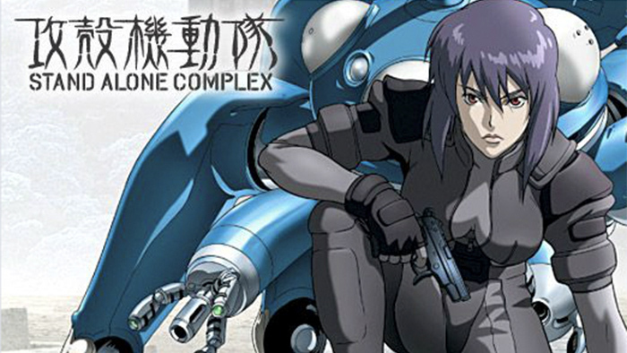

# 私のおすすめのアニメ
## 攻殻機動隊 STAND ALONE COMPLEX

>画像の引用 : https://www.ntv.co.jp/kokaku-s1/static/story.html

## 囁くのよ、私のゴーストが・・・
### あらすじ
>西暦2030年、電脳化が一般化され情報ネットワークが高度化する中で、光や電子として駆け巡る意思を一方向に集中させたとしても、「孤人」が複合体（コンプレックス）としての「個」となるまでには情報化されていない時代。複雑化する犯罪に対抗するため、内務省直属の独立防諜部隊として設立された「公安9課」（通称「攻殻機動隊」）の活躍を描く。(引用:Wikipedia)

---
#### 魅力
- 今だからこそ伝わる情報化の便利さと弊害の描写
- "自分"とは何かを問う哲学性

[戻る](./index.md)
