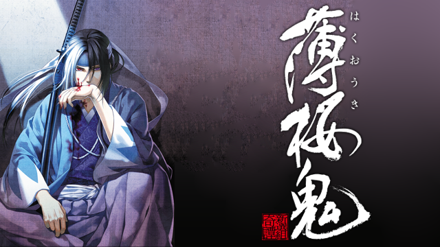

# 私のおすすめのアニメ
## 薄桜鬼

>画像の引用 : https://www.fami-geki.com/vod/anime-hakuoki1/

## まがいものだろうがなんだろうが、貫きゃ誠になるはずだ！
### あらすじ
>文久三年十二月一幕末。
父を探しに京を訪れた少女・雪村千鶴は、"人斬り集団”と恐れられる 新選組に出会う。
千鶴の父が研究していた秘薬、そのによって生み出される血に飢えた化け物たち。薩摩長州に属する“鬼”と呼ばれる人外の者たちの存在。 そして、千鶴自身の秘密--。幕末から明治という激動の時代に武士道を貫き、 最期まで「誠」を旗を掲げ続けた男たちと、彼らと共に生きることを選んだ一人の少女の物語。(引用:アニメ公式サイト)

---
#### 魅力
- 激しい戦いの中で生まれる切ない恋模様
- 最期まで信念を貫き続けた志士たちの生き様

[戻る](./index.md)