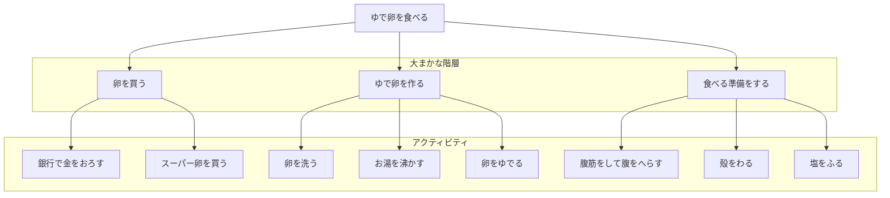

```mermaid
flowchart TB
    id1["ゆで卵を食べる"];
    subgraph 大まかな階層
    id2["卵を買う"];
    id3["ゆで卵を作る"]
    id4["食べる準備をする"]
    end
    subgraph アクティビティ
    id5["銀行で金をおろす"]
    id6["スーパー卵を買う"]
    id7["卵を洗う"]
    id8["お湯を沸かす"]
    id9["卵をゆでる"]
    id10["腹筋をして腹をへらす"]
    id11["殻をわる"]
    id12["塩をふる"]
    end
    id1-->id2
    id1-->id3
    id1-->id4

    id2-->id5
    id2-->id6

    id3-->id7
    id3-->id8
    id3-->id9

    id4-->id10
    id4-->id11
    id4-->id12
```

